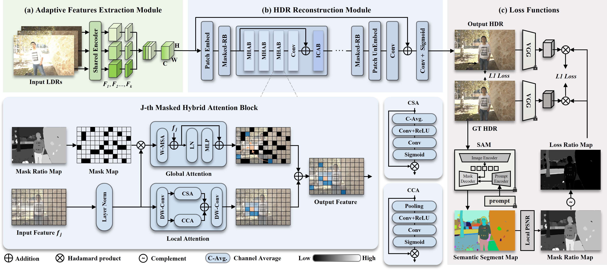

# Semantic Masking with Curriculum Learning for Robust HDR Image Reconstruction

#### International Journal of Computer Vision, 2025

[Zhangkai Ni](https://eezkni.github.io/)<sup>1</sup>, Yang Zhang<sup>1</sup>, Kerui Ren<sup>1</sup>, [Wenhan Yang](https://flyywh.github.io/)<sup>2</sup>, [Hanli Wang](https://scholar.google.com/citations?user=WioFu64AAAAJ&hl=zh-CN)<sup>1</sup>, [Sam Kwong](https://scholar.google.com/citations?user=_PVI6EAAAAAJ&hl=zh-CN)<sup>3</sup>

<sup>1</sup>Tongji University, <sup>2</sup>Peng Cheng Laboratory, <sup>3</sup>Lingnan Univerity

This repository provides the official implementation for the paper "Semantic Masking with Curriculum Learning for Robust HDR Image Reconstruction," International Journal of Computer Vision, 2025. [Paper](https://link.springer.com/article/10.1007/s11263-025-02504-5?utm_source=rct_congratemailt&utm_medium=email&utm_campaign=nonoa_20250703&utm_content=10.1007/s11263-025-02504-5)



## About SMHDR

High Dynamic Range (HDR) image reconstruction aims to reconstruct images with a larger dynamic range from multiple Low Dynamic Range (LDR) images with different exposures. Existing methods face two challenges: visual artifacts in the restored images and insufficient model generalization capabilities. This paper addresses these issues by leveraging the inherent potential of Masked Image Modeling (MIM). We propose a Segment Anything Model (SAM)-guided masking strategy, leveraging large-model priors to direct the HDR reconstruction network via curriculum learning. This strategy gradually increases the difficulty from simple to complex tasks, guiding the model to effectively learn semantic priors that prevent the model from overfitting to the training data. Our approach starts by training the model without any masks, then progressively increasing the masking ratio of input features guided by semantic segmentation maps, which compels the model to learn semantic information during restoration. Subsequently, we make an adaption to reduce the masking ratio to minimize the input discrepancy between the training and testing stage. Besides, we manipulate the computation of the loss based on the perceptual quality of reconstructed images, where challenging areas (e.g., over-/under-exposed regions) are given more weight to improve image restoration results. Furthermore, through specialized module design, our method can be fine-tuned to any number of inputs, achieving comparable performance to models trained from scratch with only 5.5\% of parameter adjustments. Extensive qualitative and quantitative experiments demonstrate that our approach surpasses state-of-the-art methods in both effectiveness and generalization. 

**TL;DR:** We propose a novel SAM-guided MIM for HDR reconstruction (SMHDR). The combination of curriculum learning strategy and masked image modeling bridges the gap between pixel fitting and semantic understanding, which successfully turns the knowledge of SAM into the intrinsic understanding of the quality issues of HDR images.

## Environment setup
To start, we prefer creating the environment using conda:
```sh
conda create -n smhdr
conda activate smhdr
pip install -r requirements.txt
```

[Pytorch](https://pytorch.org/) installation is machine dependent, please install the correct version for your machine.

<details>
  <summary> Dependencies (click to expand) </summary>

  - `PyTorch`, `timm`: main computation.
  - `tqdm`: progress bar.
  - `opencv-python`: image processing.
  - `imageio`: images I/O.
  - `einops`: torch tensor shaping with pretty api.
  - `tensorflow`: SSIM calculation.
  - `segment_anything`: create image masks.

</details>

## Getting the data
The Kalantari's dataset, Prabhakar's dataset and Tel's dataset are used in our paper and can be downloaded through the following links:

- [Kalantari's dataset](https://github.com/TH3CHARLie/deep-high-dynamic-range/blob/master/data/download.sh)
- [Prabhakar's dataset](https://val.cds.iisc.ac.in/HDR/ICCP19/)
- [Tel's dataset](https://github.com/Zongwei97/SCTNet)

## Directory structure for the datasets

<details>
  <summary> (click to expand;) </summary>

    data_path
    ├── Kalantari's     # Link: https://github.com/TH3CHARLie/deep-high-dynamic-range/blob/master/data/download.sh
    │   ├── Training
    │   │    ├── 001
    │   │    │    ├── 262A0898.tif
    │   │    │    ├── 262A0899.tif
    │   │    │    ├── 262A0900.tif   # variable name, sorted by exposure time
    │   │    │    ├── exposure.txt   # fixed name
    │   │    │    ├── HDRImg.hdr     # fixed name
    │   │    │    └── masks.npy      # fixed name
    │   │    ├── 002
    │   │    └── ...
    │   └── Test
    │        ├── 001
    │        │    ├── 262A2615.tif
    │        │    ├── 262A2616.tif
    │        │    ├── 262A2617.tif
    │        │    ├── exposure.txt
    │        │    ├── HDRImg.hdr
    │        │    └── masks.npy
    │        ├── 002
    │        └── ...
    ├── Prabhakar's    # Link: https://val.cds.iisc.ac.in/HDR/ICCP19/
    │   ├── Training
    │   │    ├── Train_set_001
    │   │    │    ├── input_ghosted_1.tif
    │   │    │    ├── input_ghosted_2.tif
    │   │    │    ├── input_ghosted_3.tif
    │   │    │    ├── exposure.txt
    │   │    │    ├── HDRImg.hdr
    │   │    │    └── masks.npy
    │   │    ├── Train_set_002
    │   │    └── ...
    │   └── Test
    │        ├── Test_set_001
    │        │    ├── input_ghosted_1.tif
    │        │    ├── input_ghosted_2.tif
    │        │    ├── input_ghosted_3.tif
    │        │    ├── exposure.txt
    │        │    ├── HDRImg.hdr
    │        │    └── masks.npy
    │        ├── Test_set_002
    │        └── ...
    └── Tel's    # Link: https://github.com/Zongwei97/SCTNet
        ├── Training
        │    ├── scene_0001_1
        │    │    ├── input_1.tif
        │    │    ├── input_2.tif
        │    │    ├── input_3.tif
        │    │    ├── exposure.txt
        │    │    ├── HDRImg.hdr
        │    │    └── masks.npy
        │    ├── scene_0001_2
        │    └── ...
        └── Test
             ├──scene_007_1
             │    ├── input_1.tif
             │    ├── input_2.tif
             │    ├── input_3.tif
             │    ├── exposure.txt
             │    ├── HDRImg.hdr
             │    └── masks.npy
             ├── scene_007_2
             └── ...

</details>


## Running the model
### Training
- Prepare the training dataset.
- Run the following commands for `mask.npy` preparing:
```bash
$ cd segmask
$ bash download.sh
$ python segment.py --dataset_dir your_dataset_directory --sam_checkpoint your_sam_ckpt_directory --train_path Training
```
- Run the following commands for stage1 training:
```bash
$ python train_phase1.py --dataset_dir your_dataset_directory --logdir your_log_directory 
```
- Run the following commands for stage2 training:
```bash
$ python train_phase2.py --dataset_dir your_dataset_directory --logdir your_log_directory  --start_epoch 301 --resume your_ckpt_directory
```


### Testing
- Prepare the testing dataset.
- Prepare the pretrained model.
- Run the following commands for `mask.npy` preparing:
```bash
$ cd segmask
$ python segment.py --dataset_dir your_dataset_directory --sam_checkpoint your_sam_ckpt_directory --train_path Test
```
- Run the following commands for testing:
```bash
$ python test.py --dataset_dir your_dataset_directory --logdir your_log_directory --pretrained_model your_ckpt_directory --save_dir your_output_directory
```


## Results
Pretrained models can be find in the `./pretrain_model` folder.

## Citation
If you find our work useful, please cite it as
```
@article{ni2025smhdr,
  title={Semantic Masking with Curriculum Learning for Robust HDR Image Reconstruction},
	author={Ni, Zhangkai, and Zhang, Yang, and Ren, Kerui, and Yang, Wenhan, and Wang, Hanli and Kwong, Sam},
	journal={International Journal of Computer Vision},
	volume={},
	pages={},
	year={2025},
	publisher={Springer}
}
```

## Acknowledgments
This code is inspired by [SCTNet](https://github.com/Zongwei97/SCTNet). We thank the authors for the nicely organized code!


## Contact
Thanks for your attention! If you have any suggestion or question, feel free to leave a message here or contact Dr. Zhangkai Ni (eezkni@gmail.com).


<!-- ## License
[MIT License](https://opensource.org/licenses/MIT) -->
